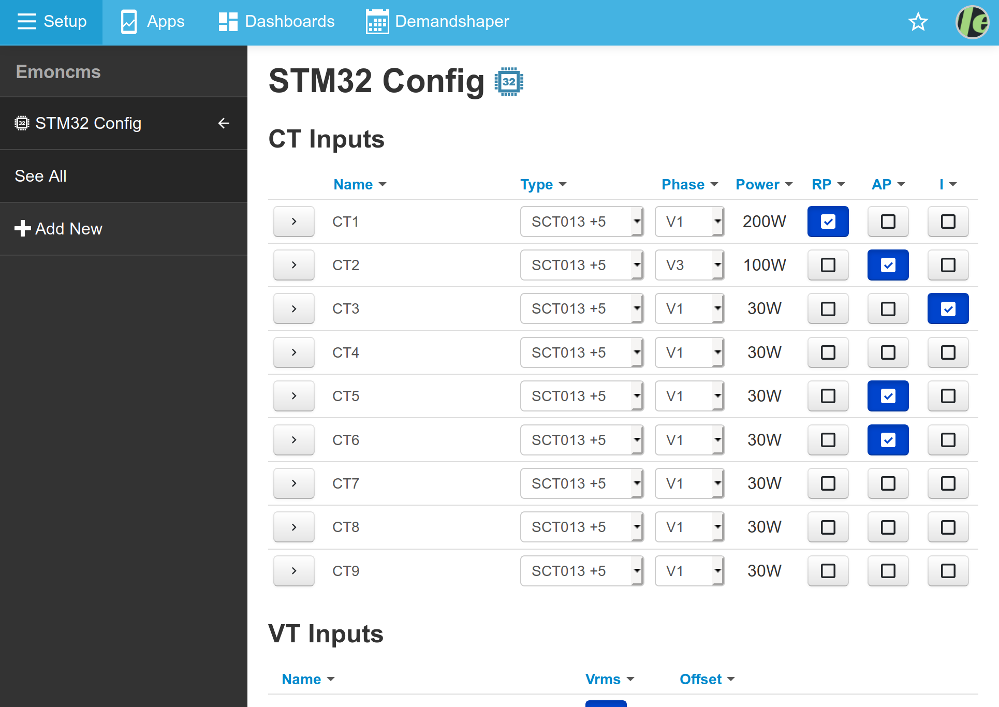

# STM32 Config
Emoncms configuration module for raspberry pi based installations of emoncms with an stm32 based emonBase


[screenshot of Module page displaying STM32 inputs]

## download
clone this repo:
```
git clone git@github.com:emoncms/stm32config.git
```
## install
create a link to the module directory (`stm32config-module`) in the `emoncms` Modules directory.
```
sudo ln -s [/path/to/this/repo/]stm32config-module /var/www/emoncms/Modules/stm32config
```
## run
click the `STM32Config` link in the emoncms sidebar to see the list. eg:
[http://localhost/emoncms/stm32config/](http://localhost/emoncms/stm32config/)

--- 

# Module Parts


## MQTT
The `STM32Config` Module will subscribe to a specific MQTT "*Request topic*" that contains the STM32 chip commands.

Once a command is received via MQTT the module will forward the command via serial connection to the STM32 chip.

Using `MQTT` with this module has another advantage in that [EmonCMS](https://github.com/emoncms/emoncms) is already set up to take input data via `MQTT`.

This makes is very easy to forward any STM32 serial data to [EmonCMS](https://github.com/emoncms/emoncms)

## Serial Data
The STM32 chip input/output/control parts will be referred to as `KEYS`.

All the `KEYS` have different properties that can be acted on using a short name (listed below).

Here are some examples and the serial command sent to the chip (using action and key short names):
eg: 
-   GET -> CT1 -> Real Power `G:CT1:RP:`
-   SET -> VT1 -> Phase = 2.52 `G:CT1:RP:2.52`


## Serial connection
The STM32 chip will commuicate via UART Serial Connection. As the python script receives serial data,
the feed is processed and publish the result to a `Response` topic that matches the original request id.

The original HTTP request to EmonCMS will subscribe to the `Response` topic and return the results to the user.


## Returned Data Structures
The different parts of this system return different data structures:


## User Interface
The module can be interacted with via a EmonCMS page.

Most of the interactions will be done using javascript and displayed to the user using [vue.js](http://vuejs.org) templates.

The `vue.js` template requires `JSON` data given to it with the following `success`,`message`,`data` properties :-
```json
{
    "success": true,
    "message": "Value received",
    "data": [
        {
            "property" : "voltage",
            "key" : "VT1",
            "value" : 244.12
        }
    ]
}
```
---
# Short Names:
To simplify the serial communications we have used "Short Names" to describe elements in the system.

To inturperate any serial instructions you should refer to the tables below:

## STM32 Instructions

| Short Name | Instruction  | Description                  |
| ---------- |--------------|------------------------------|
| G          | GET          | Get a Key's value            |
| S          | SET          | Set a Key's value            |
| L          | LIST         | List all Keys                |
| SAMP       | SAMPLE       | Get sequence of Key's values |
| DUMP       | DUMP         | Get the standard output      |
| BAK        | BACKUP       | Get the config settings      |


## Keys

Within the context of this module the name `KEYS` is given to refer to the STM32 Inputs, Outputs or Addons.

No `Short Name` is used to refer to keys.

| Key       | TYPE    |
|-----------|---------|
| CT1-CT9   | INPUT   |
| VT1-VT5   | INPUT   |
| SYS       | SYSTEM  |
| LED1      | OUTPUT  |
| MBUS      | INPUT   |
| TEMP      | INPUT   |
| PULSE     | INPUT   |
| IRDA      | INPUT   |

## Properties

Different `KEY` types will have different properties. Each property is given a `Short Name`.
`Short Names` can conflict across `KEY` types.

> eg. The `Short Name` "`V`" represents differnet properties by the `SYS` and `VT1` keys.

| Short Name | Property    | Example Key |
|------------|-------------|-------------|
| **V**      | **Voltage** | **VT1**     |
| RP         | RealPower   | CT1         |
| C          | Current     | CT1         |
| PF         | PowerFactor | CT1         |
| ON         | On          | LED1        |
| **V**      | **Version** | **SYS**     |
