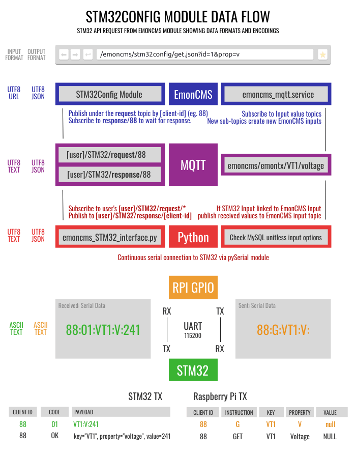
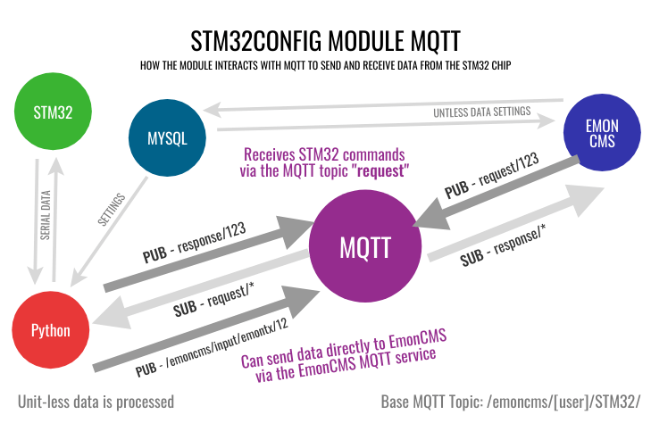

# STM32 Config
Emoncms configuration module for raspberry pi based installations of emoncms with an stm32 based emonBase


## install


clone this repo:
```
git clone git@github.com:emoncms/stm32config.git
```

create a link to the `stm32config-module` directory in the `emoncms` Modules directory.
```
sudo ln -s [/path/to/this/repo/]stm32config-module /var/www/emoncms/Modules/stm32config
```

click the `STM32Config` link in the emoncms sidebar to see the list


## Returned Data Structures
The different parts of this system return different data structures.



The `vue.js` template requires `JSON` data with the following structure:
```json
{
    "success": true,
    "message": "Value received",
    "data": [
        {
            "property" : "voltage",
            "key" : "VT1",
            "value" : 244.12
        }
    ]
}
```


## STM32 Commands / Instructions

Current list of actions:

| CODE | Instruction  | Description                  |
| ---- |--------------|------------------------------|
| G    | GET          | Get a Key's value            |
| S    | SET          | Set a Key's value            |
| L    | LIST         | List all Keys                |
| SAMP | SAMPLE       | Get sequence of Key's values |
| DUMP | DUMP         | Get the standard output      |
| BAK  | BACKUP       | Get the config settings      |


## Keys

Inputs, Outputs or additional items are referred to as Keys. No code is used to refer to keys.

| Key     | TYPE    |
|---------|---------|
| CT1-CT9 | INPUT   |
| VT1-VT5 | INPUT   |
| SYS     | SYSTEM  |
| LED1    | OUTPUT  |
| MBUS    | INPUT   |
| TEMP    | INPUT   |
| PULSE   | INPUT   |
| IRDA    | INPUT   |

## Properties

Keys will have different properties dependant on their type. Each property is given a code.

Property codes can conflict across keys, but cannot conflict with codes on the same Key.

> eg. The code `V` represents differnet properties by the `SYS` and `VT1` keys.

| Code | Property    | Example Key |
|------|-------------|-------------|
| V    | Voltage     | VT1         |
| RP   | RealPower   | CT1         |
| C    | Current     | CT1         |
| PF   | PowerFactor | CT1         |
| ON   | On          | LED1        |
| V    | Version     | SYS         |

## Serial Data
All the key properties can return or save a value using the above convertion tables.

Here are some examples and the serial command sent to the chip:
eg: 
-   GET -> CT1 -> Real Power `G:CT1:RP:`
-   SET -> VT1 -> Phase = 2.52 `G:CT1:RP:2.52`

## MQTT
The `STM32Config` Module will subscribe to a specific `Request` MQTT topic that contains commands to be issued to the STM32.

Once a command is issued it will send the command via serial connection to the STM32.


## Serial connection
The STM32 chip will commuicate via UART Serial Connection. As the python script receives serial data,
the feed is processed and publish the result to a `Response` topic that matches the original request id.

The original HTTP request to EmonCMS will subscribe to the `Response` topic and return the results to the user.

